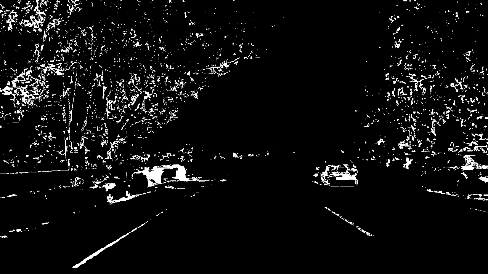
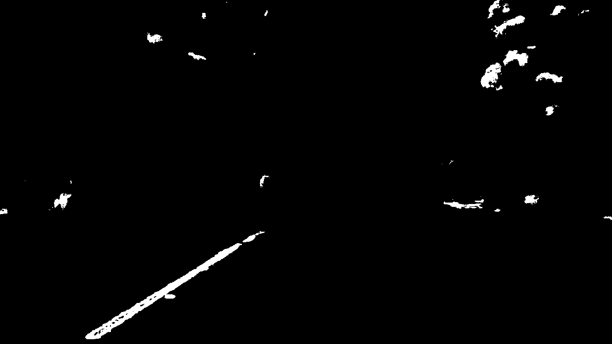
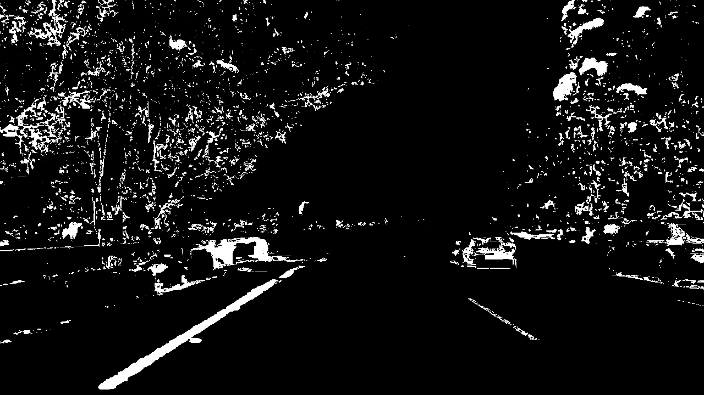
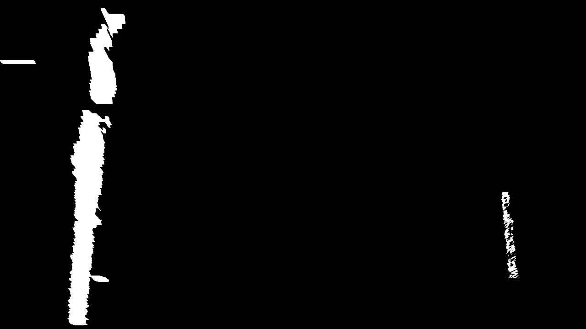
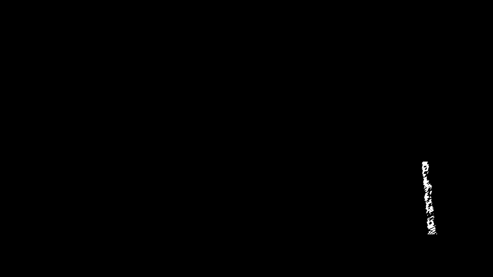

## Project - Advanced Lane finding

### This is my writeup for the advanced lane finding project. I think so far this was the hardest challenge, but I enjoyed working on this problem.

---

**Advanced Lane Finding Project**

The goals / steps of this project are the following:

* Compute the camera calibration matrix and distortion coefficients given a set of chessboard images.
* Apply a distortion correction to raw images.
* Use color transforms, gradients, etc., to create a thresholded binary image.
* Apply a perspective transform to rectify binary image ("birds-eye view").
* Detect lane pixels and fit to find the lane boundary.
* Determine the curvature of the lane and vehicle position with respect to center.
* Warp the detected lane boundaries back onto the original image.
* Output visual display of the lane boundaries and numerical estimation of lane curvature and vehicle position.

### The rubric points: 

---
Throughout the document I will refer to this . I applied the transformations to this image, so they are nicely represented. 

### Camera Calibration

#### 1. I used the opencv function to compute the picture distortion matrix. I have included pictures of the distorted images in the [ipython notebook](./solutions/solution.ipynb). I used the methods taught during the class, such as `cv2.calibrateCamera()` and then undistorted the image with `cv2.undistort()`. You can see here the .

### Pipeline (single images)

#### 2. Thresholding

I have tried out different thresholding techniques, but in the end I used S and L color channels. I found L color channel (from LUV color space), to be really good for this task, however it missed the right line a couple of times, that is why I kept in the S channel, which was a bit more noisier.You can see the different pictures, also the combined output of them. 

#### 3. Warping

I used opencv's warp function to create the birds eye view. I have experimented a lot with the different source and destination points, however I am quite happy with the result. I also checked warping back the image, it worked well. You can see the 4 source points in the notebook and the  image here. 

#### 4. (also 6.) Lane identifing 

I used the code from class as basis, but modified a lot to be able to work with the video. I searched around the max of the histogram with the window method in the beginning and when the pipeline lost track of a line, however used the mean of the previous 10 iterations when the line was sucessfully founded beforehand. This helped the video to perform better, as sometimes the histogram didn't report on the lane, but rather on some other stuff. If there was no line found by the polynomial fit, I used the average of the previous fits. This gave me slightly worse results overall, as with this approach the adjusting of the lines were little slower, however it also helped in recovering the lines.

I built in several regulariziers, so any outlying result (base point or coefficient that were bigger than the previous ones by a threshold) would  be discarded. I also always kept the last 10 good results for the base points and coefficients of the polynomial and used the average over them to overcome really jumping lines. I have also masked one part of the picture so the polynomials coming from the image were ready to be used, even if I had two different instances for the left and the right part of the lane.

#### 5. Radius

I used the method from the class. It can be seen in the ipython notebook.

---

### Pipeline (video)

#### 1. [Video of the final project](./output_images/proj_video_o.mp4)

---

### Discussion

#### 1. Performance on challenge videos

I checked, and on the harder challenge the pipeline did better, however the normal challenge didn't perform that well. It is because  of the starting values, but changing them should solve the problem. 

The speed of the pipeline could be made better with some refactoring and abstractions in the code.

The binaryoutput of the image transformation is also sometimes little too noisy, so that could be improved.
